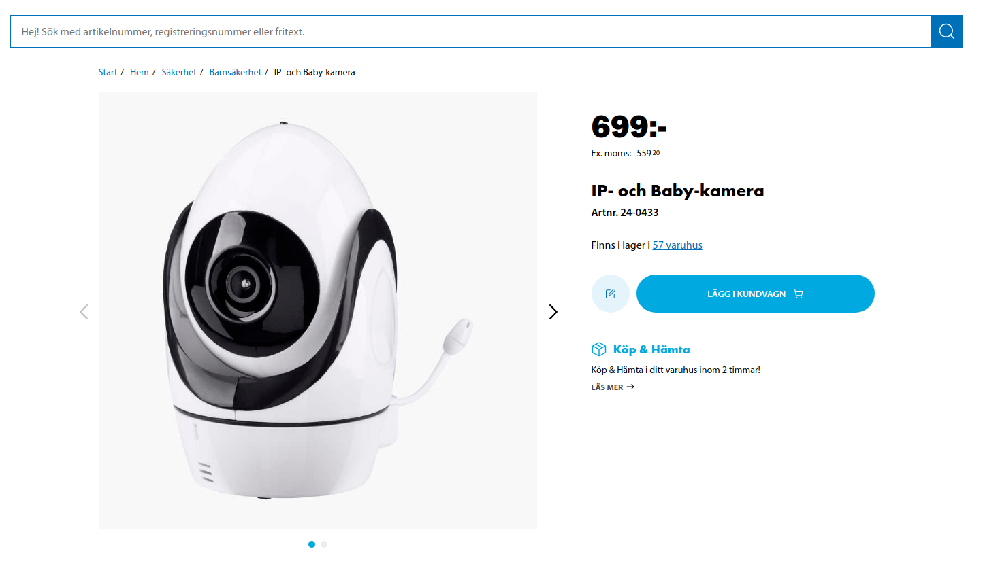

# Biltemeas Babycam

A friend asked for help with this cam, the password under the cam does not work and in playstore there is alot of ppl that seems have the same problem.

#### Here you go: 

    Lets Hack: 

    Poweron your babycam
    Connect to the babycams wifi 
    Once connected, find ip to the cam:

    for ip in 192.168.1.{1..254}; do
        ping -c 1 -W 1 $ip | grep "64 bytes" &
    done
 
Connect to the webcam:

    telnet 192.168.1.X

    Login:      root
    Password:   root

    Create wpa_supplicant.conf

    cat << EOF > /mnt/sif/wpa_supplicant.conf
    ctrl_interface=/var/run/wpa_supplicant
    network={
    ssid="EDIT_THIS"
    psk="EDIT_THIS"
    scan_ssid=1
    key_mgmt=WPA-EAP WPA-PSK IEEE8021X NONE
    pairwise=TKIP CCMP
    group=CCMP TKIP WEP104 WEP40
    eap=TTLS PEAP TLS
    proto=WPA RSN
    frequency=2414
    scan_freq=2412
    }
    EOF

Then Reboot! 

    reboot

Now you will see the app in your biltemas shitty application 
    
Download app: https://play.google.com/store/apps/details?id=hk.biltema.com&hl=no&gl=US

#### Those cams are dangerous, really! They claim there is no cloud but that is really needed?

 

#### Manuals

    https://www.biltema.se/BiltemaDocuments/Manuals/24-0433_man.pdf
